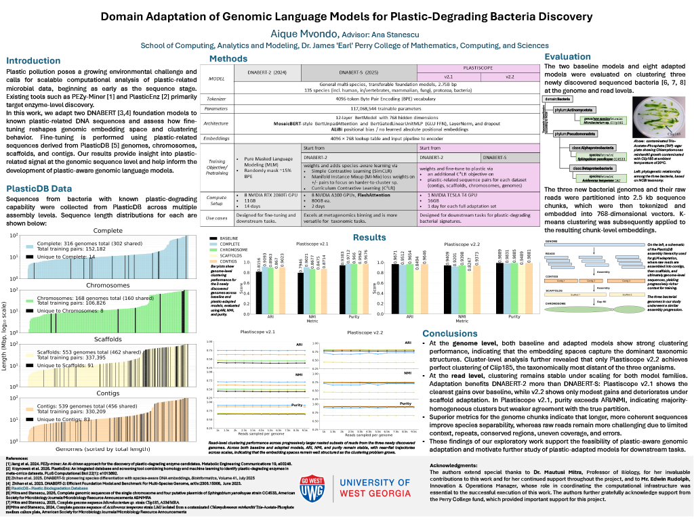

# Experiment-With-DNABERT-S

> **Domain Adaptation of Genomic Language Models for Plastic-Degrading Bacteria Discovery**
> Aique Mvondo · Advisor: Dr. Ana Stanescu · University of West Georgia
> Presented at **NCUR 2026**, UWG Scholars' Day, and GURC 2025

📄 **[View the full NCUR 2026 research poster](NCUR_2026_Poster.pdf)**



---

## Project Overview

Existing tools such as PEZy-Miner and PlasticEnz look for plastic-degrading potential at the **enzyme level**. This project asks whether that signal can be captured earlier, at the **raw DNA sequence level**, by adapting genomic language models to known plastic-related bacteria.

This repository contains the evaluation pipeline (embedding → clustering → scoring) used to test the baseline and plastic-adapted models on three newly sequenced bacteria.

## What I Did

| Stage | Work |
|---|---|
| **Data collection** | Pulled sequences from bacteria with known plastic-degrading capability in **PlasticDB** across 4 assembly levels |
| **Training data** | Built **926,612 sequence pairs** for fine-tuning: Complete (152,182), Chromosomes (106,826), Scaffolds (337,395), Contigs (330,209) |
| **Models** | Adapted two 117M-parameter foundation models, **DNABERT-2** and **DNABERT-S**, into **Plastiscope v2.1** and **v2.2**, one model per assembly level → **8 adapted models + 2 baselines** |
| **Compute** | Ran each full adaptation set in ~1 day on a single NVIDIA Tesla T4 (16 GB) in Microsoft Azure |
| **Evaluation data** | 3 newly sequenced bacteria: *Sphingobium yanoikuyae* CC4533, *Microbacterium* sp. Clip185, *Acidovorax temperans* LMJ |
| **Evaluation method** | Split genomes and raw reads into 2.5 kb chunks → 768-dimensional embeddings → K-means (k = 3) → scored with **ARI, NMI, and Purity** |

## Key Findings

### 1. Plastic adaptation clearly improved DNABERT-2 (Plastiscope v2.1)

Genome-level clustering, baseline DNABERT-2 vs. best adapted model (Complete genomes):

| Metric | Baseline | Plastiscope v2.1 (Complete) | Improvement |
|---|---|---|---|
| ARI | 0.8156 | **0.9093** | +11.5% |
| NMI | 0.7946 | **0.9021** | +13.5% |
| Purity | 0.9383 | **0.9712** | +3.5% |

All four adapted v2.1 models outperformed the baseline on every metric.

### 2. DNABERT-S started strong, so gains were smaller (Plastiscope v2.2)

| Metric | Baseline DNABERT-S | Best v2.2 (Chromosome) | Scaffold-adapted v2.2 |
|---|---|---|---|
| ARI | 0.9671 | 0.9654 | 0.8494 |
| NMI | 0.9409 | 0.9398 | 0.8247 |
| Purity | 0.9889 | 0.9885 | 0.9489 |

The species-aware DNABERT-S baseline already separated the organisms well. Adaptation largely preserved that performance, except for scaffold adaptation, which degraded it.

### 3. Only Plastiscope v2.2 perfectly clustered the most distant organism

Cluster-level analysis showed that **only v2.2 achieved perfect clustering of Clip185**, the taxonomically most distant of the three bacteria.

### 4. Results held steady as the problem scaled

At the read level, ARI, NMI, and Purity stayed nearly flat from **1,000 to 9,500 reads sampled per genome**, for both baseline and adapted models. This shows the embedding spaces remain well structured as data volume grows.

### 5. Longer sequences separate species better

Genome chunks scored higher than raw reads. Reads are harder to cluster because of limited context, repeats, conserved regions, uneven coverage, and sequencing errors.

## Conclusion

This research showed that **plastic-aware adaptation of genomic language models is feasible**, with the clearest benefit for DNABERT-2. It motivates further work on plastic-adapted models for downstream tasks such as classifying unknown bacteria by plastic-degrading potential.

## Acknowledgments

Thanks to Dr. Ana Stanescu (advisor), Dr. Mautusi Mitra (Professor of Biology), Mr. Edwin Rudolph (Innovation & Operations Manager, computational infrastructure), and the Perry College fund.

---

## Reproduce the Evaluation
*(setup steps below)*

# 1 - Setup Environment :

## Clone the git repository & and create a new folder:  
```
git clone https://github.com/MAGICS-LAB/DNABERT_S.git
cd DNABERT_S
```
## Activate Anaconda:
```
source ~/anaconda3/bin/activate  
```

## Create and activate the Environment: 
```
conda create -n DNABERT_S python=3.9
conda activate DNABERT_S
```

## Install dependencies:
```
pip install -r requirements.txt
pip uninstall triton # this can lead to errors in GPUs other than A100
```

##  Install gdwon (for downloading model/data): 
```
pip install gdown 
```

## Download pretrained model (Google Drive):
```
gdown 1ejNOMXdycorDzphLT6jnfGIPUxi6fO0g 
unzip DNABERT-S.zip   
```

# 2 - Preprocess the Data and Run the experiment

## Convert fastq files: 
--> Skip this step for fasta files
```
seqtk seq -a cc4533.fastq > cc4533.fastq.fasta 
seqtk seq -a Clip185.fastq > Clip185.fastq.fasta 
seqtk seq -a LMJ.fastq > LMJ.fastq.fasta
```

## Concatenate the converted files into one:
```
cat cc4533.fastq.fasta Clip185.fastq.fasta LMJ.fastq.fasta > converted_reads.fasta 
```
## Install Biopython
```
if using pip
pip install biopython

if using conda
conda install -c conda-forge biopython
```

## Generate embeddings:
```
python generate_chunk_embeddings.py  
--fasta converted_reads.fasta  
--output converted_reads_embeddings.npz 
```

## Clustering:
```
python cluster_chunks.py  
--embeddings converted_reads_embeddings.npz  
--n-clusters 3 
--output converted_reads_clusters.npz
```

## Evaluation:
```
python evaluate_clustering.py  
--clusters converted_reads_clusters.npz  
--metadata converted_reads_embeddings_metadata.csv  
--output converted_reads_evaluation.txt 
```

